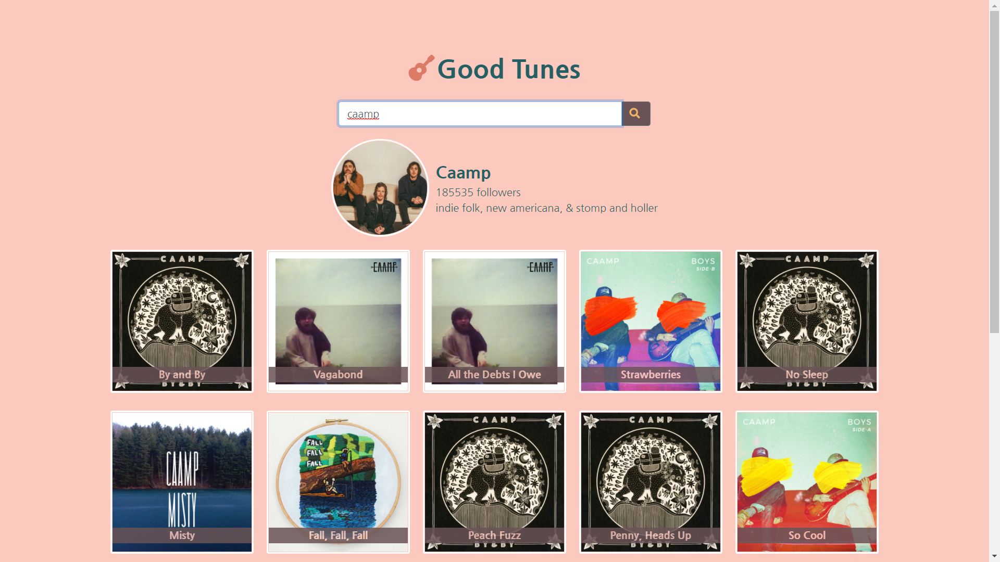
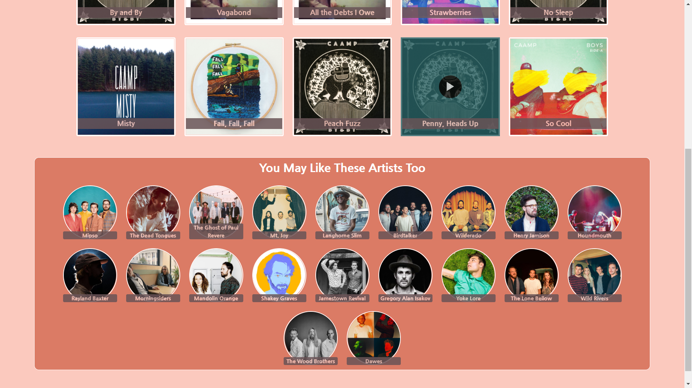

# Good-Tunes




# To Install
In your preferred directory, run:
```
git clone git@github.com:ygsnyder/Good-Tunes.git
cd Good-Tunes
npm install
npm start
```

If your browser doesn't automatically pop open a new tab, navigate to localhost:3000

# What it Does
* Search for an artist
* Listen to 30 second previews of their top tracks
* See and select similar artists 

